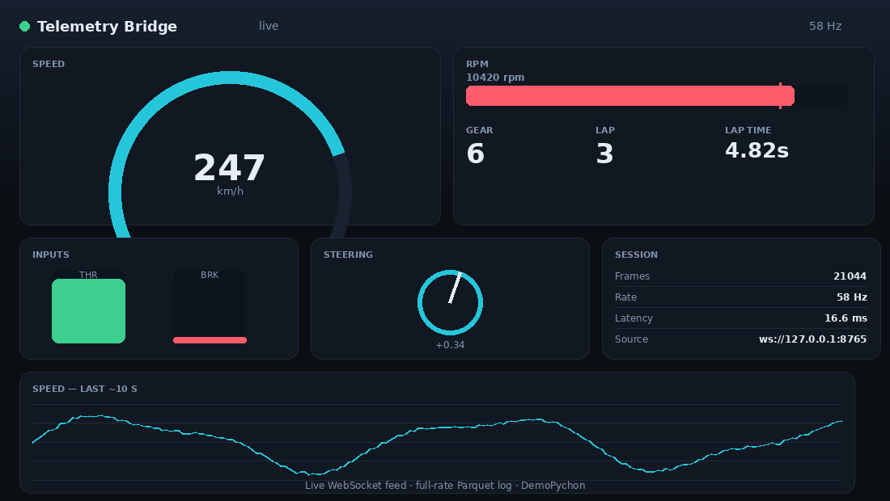

# telemetry-bridge


Real-time telemetry, split into two streams at two rates off a single async core:

- a **WebSocket** feed capped at a display rate (60 Hz) for a live UI, and
- a **Parquet** log that captures **every** frame at the full source rate (360 Hz),

with a live browser **dashboard** on top. The source here is a mock sim-racing
generator, so it all runs with no game or hardware attached — the same pipeline
takes a real iRacing / AC / ACC shared-memory adapter in place of the mock.



## Quick start

```bash
pip install -r requirements.txt
python run_demo.py --seconds 30
```

Open **http://127.0.0.1:8080** — live speed/rpm gauges, throttle & brake bars,
steering, gear, lap time and a rolling speed chart, fed over
`ws://127.0.0.1:8765` while every frame lands in `session.parquet`.

```bash
python run_demo.py --seconds 10 --no-ws        # log only, no UI
python run_demo.py --replay session.parquet     # replay a recording into the dashboard
```

## Tests

```bash
pytest -q          # 10 tests, incl. a real WebSocket client round-trip
```

`pytest -q` — 10 tests.

## Why it's built this way

- **Rate split.** A 360 Hz source shouldn't flood a browser; a 60 Hz UI
  shouldn't cost you log fidelity. The log runs at full rate, the socket is
  downsampled, and neither blocks the other.
- **Isolated broadcaster.** A slow or dead WebSocket client is dropped, never
  allowed to delay a logged frame.
- **Batched Parquet.** Frames flush in row groups, so logging at hundreds of Hz
  doesn't stall the loop; a full session stays small and re-opens instantly in
  pandas / DuckDB.
- **Pure sampler.** `MockTelemetrySource.sample(t)` is a pure function of time —
  channel behaviour is unit-tested without the event loop.

## Layout

```
src/telemetry_bridge/
  frame.py           TelemetryFrame — one sample
  mock_source.py     deterministic mock source (swap for a real sim adapter)
  parquet_logger.py  batched full-rate writer + session reader
  replay.py          re-stream a recorded session at original timing
  ws_server.py       async WebSocket broadcaster
  bridge.py          source -> Parquet (full) + WebSocket (capped)
dashboard/index.html live gauges + chart (vanilla JS, no build step)
run_demo.py          CLI
tests/               pytest + pytest-asyncio
```

MIT licensed.
